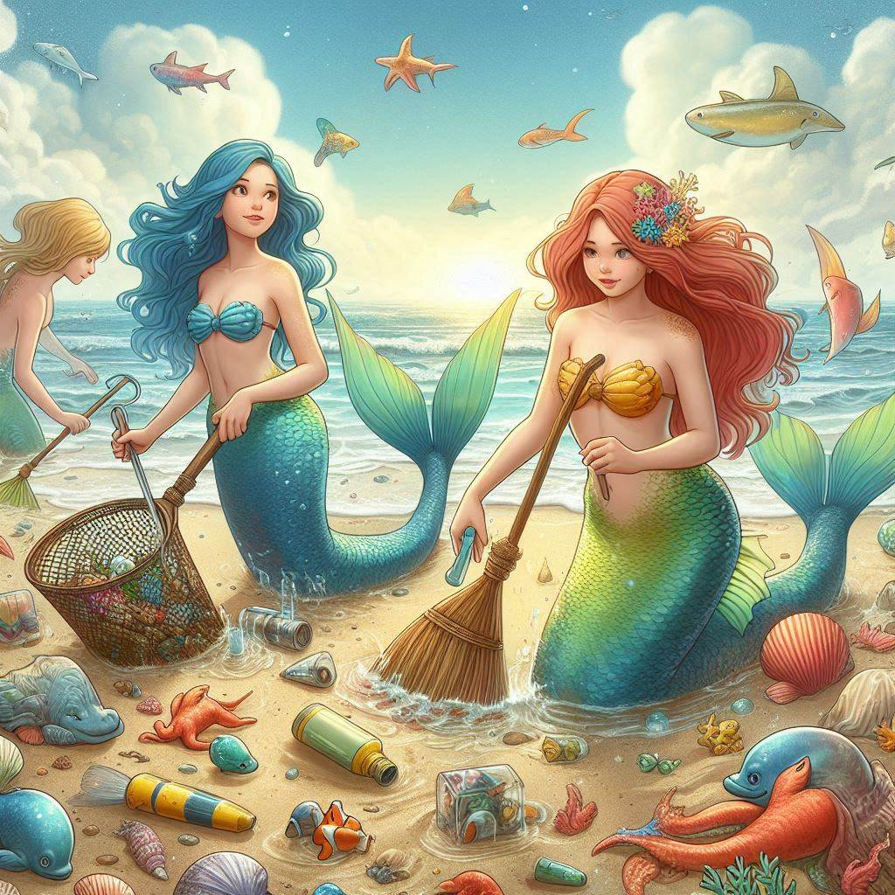

## How to survive as a mermaid in LA

### Addressing the Elephant in the Room
Since the days of Atlantis, we merfolk have chosen to keep our distance from humans. However, with the increasing destruction of our habitats, many of us now find ourselves forced to surface more frequently. This guide will help you navigate LA and remind you that moving forward and thriving, even, is still possible.

### Stick to Large, Private, Aquatic Spaces
Always prefer aquatic spaces, as you never know when you’ll need to make a quick getaway. Nobody likes to feel restricted, and thankfully, the Los Angeles area offers ample options to swim in with diverse ecology. Avoid chlorinated pools; they may sound tempting, but your gills will thank you for staying away. Locations like Marina del Rey and Laguna Beach are adored for their private docks and bouldered, enclosed spaces.

### Be a Role Model
It is imperative to protect the environment—so no littering! Littering is treasonous. Be a role model and encourage good behavior among humans. Engage with our environmental group (the secret-mermaid-society in disguise), because unlike humans, we actually understand the urgency.

### Don't forget to take Time to Relax
Don't stress! You're young, you're beautiful, and life is great --even with a tail. Find a quiet spot to relax and enjoy the moment. There's no going wrong with dining at the San Pedro Fish Market, or Redondo Beach's many seafood restaurants along the pier.

### Take Cover
Coming out of the ocean? Don't forget your beach towels! Bring a large umbrella to avoid being spotted from above and have a couple towels handy while your tail subsides. Sunglasses can also help keep you anonymous. Further, humans should generally be avoided, especially the scientists.

### Conclusion
Times are tough, but remember, you're just one merperson, and life doesn't need to be taken too seriously. Take it all with a grain of salt, stay discreet, and enjoy the ride.
