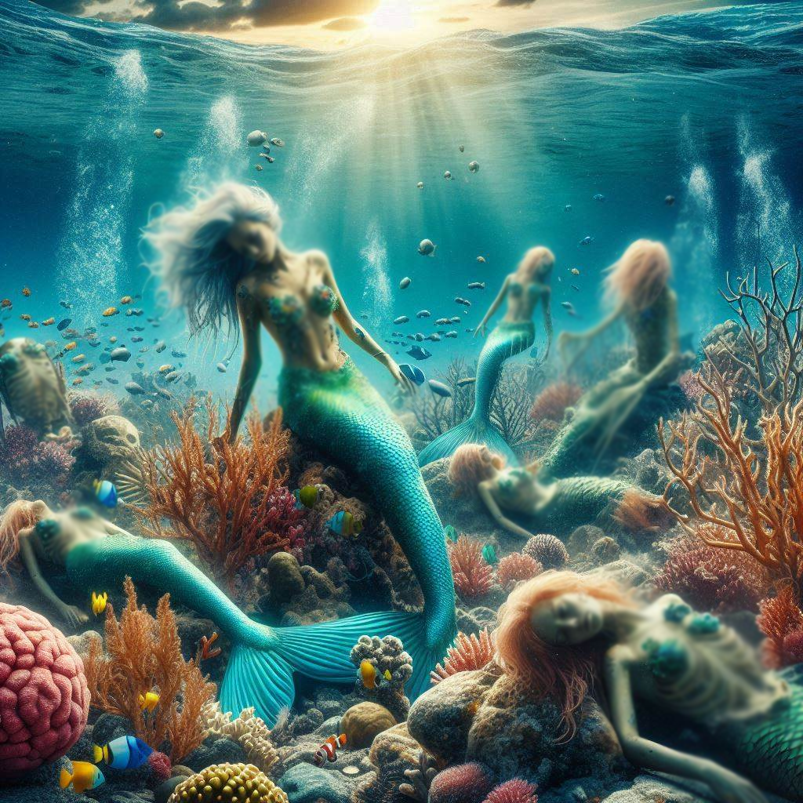
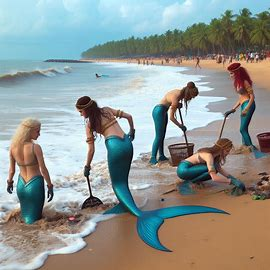
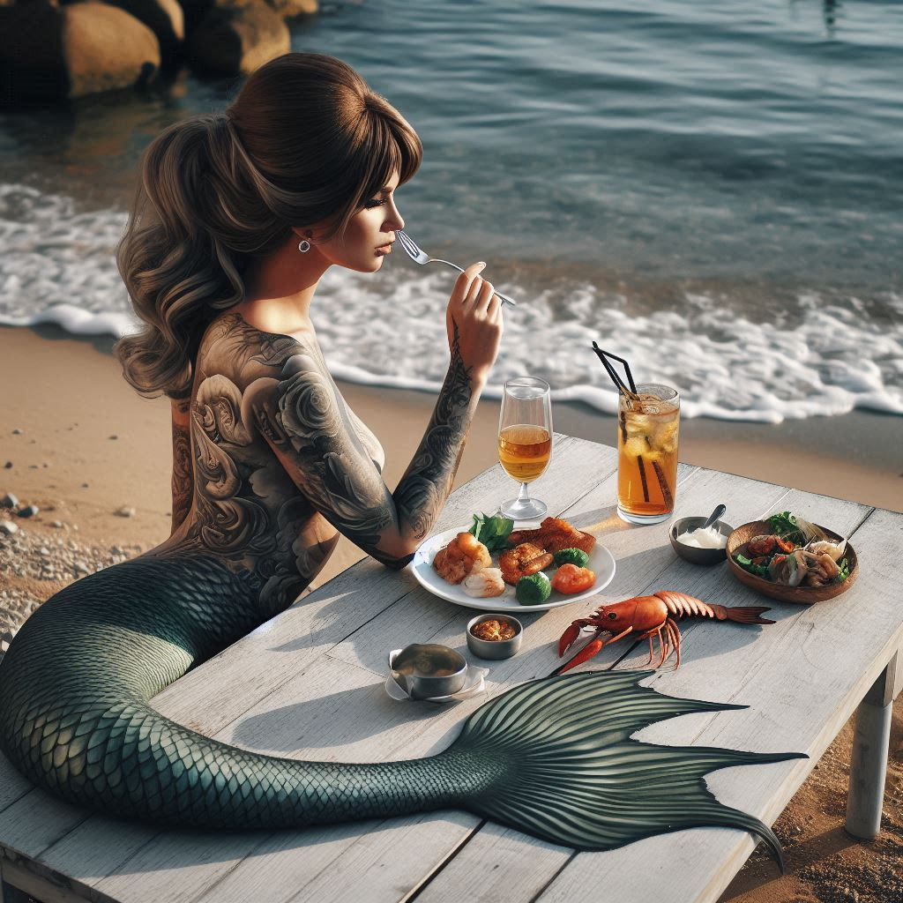

## How to survive as a mermaid in LA

### Addressing the Elephant in the Room
Since the days of Atlantis, we merfolk have chosen to keep our distance from humans. However, with the increasing destruction of our habitats, many of us now find ourselves forced to surface more frequently. This guide will help you navigate LA and remind you that moving forward and thriving, even, is still possible.

&nbsp;

### Stick to Large, Private, Aquatic Spaces
- Always prefer aquatic spaces; you never know when you’ll need to make a quick getaway.
- Nobody likes to feel restricted, and thankfully, the Los Angeles area offers ample options to swim in with diverse ecology.
  - Marina del Rey: Known for its private docks.
  - Laguna Beach: Features bouldered, enclosed spaces.
- Avoid chlorinated pools; they may sound tempting, but your gills will thank you for staying away.

&nbsp;

### Be a Role Model
It is imperative to protect the environment—so no littering! Be the change you wish to see and encourage good behavior among humans when given the chance. Keep the mermaid community strong and engage with us in our environmental group (the secret-mermaid-society in disguise).

&nbsp;

### Don't forget to take Time to Relax
Don't stress! You're young, you're beautiful, and life is great --even with a tail. Find a quiet spot to relax and enjoy the moment. With countless options, you can't go wrong, but the San Pedro Fish Market, or Redondo Beach's many seafood options are clear standouts.

&nbsp;

### Try Not To Be Ousted
- Essentials to bring with you to the beach:
  - Bring towels: Cover up while your tail subsides after emerging from the water.
  - Use a large umbrella: Prevent being spotted from above and ensure some privacy while you dry off.
  - Sunglasses: Keep a low profile and avoid unwanted attention.
- Remember, humans should generally be avoided—especially scientists.

&nbsp;

### Conclusion
Times may be tougher than ever, but remember, you're just one mer-person, and life doesn't need to be taken too seriously. Take it all with a grain of salt, behave discreetly, and enjoy the ride.
